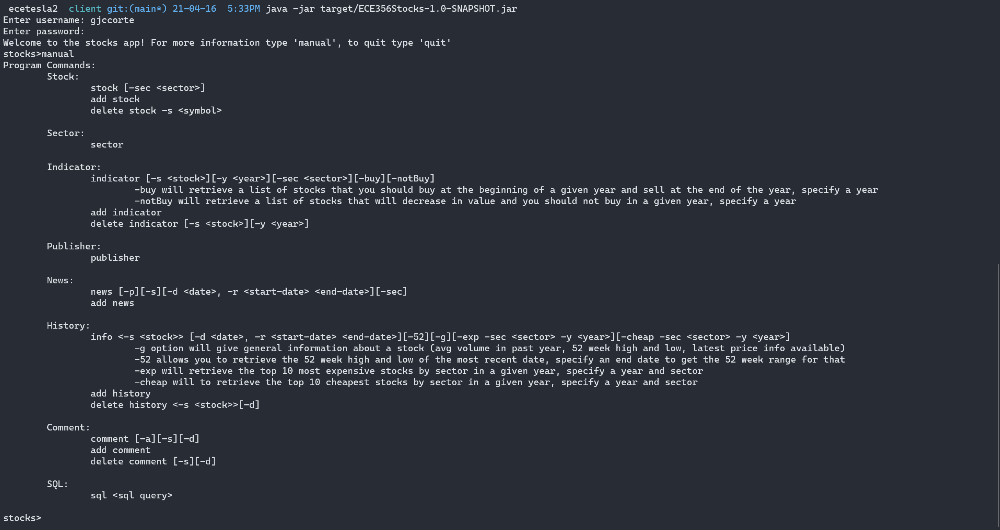

# ECE356-Project
This application was developed to work on eceubuntu.

The server directory contains the sql script to create the database within the marmoset servers.

The client directory contains the source code for the client application, it is a maven project which uses several dependencies to facilitate connections with the database as well as reading user inputs. 

To use the application:
```
cd client;
mvn clean install package;
java -jar target/ECE356Stocks-1.0-SNAPSHOT.jar;
```

